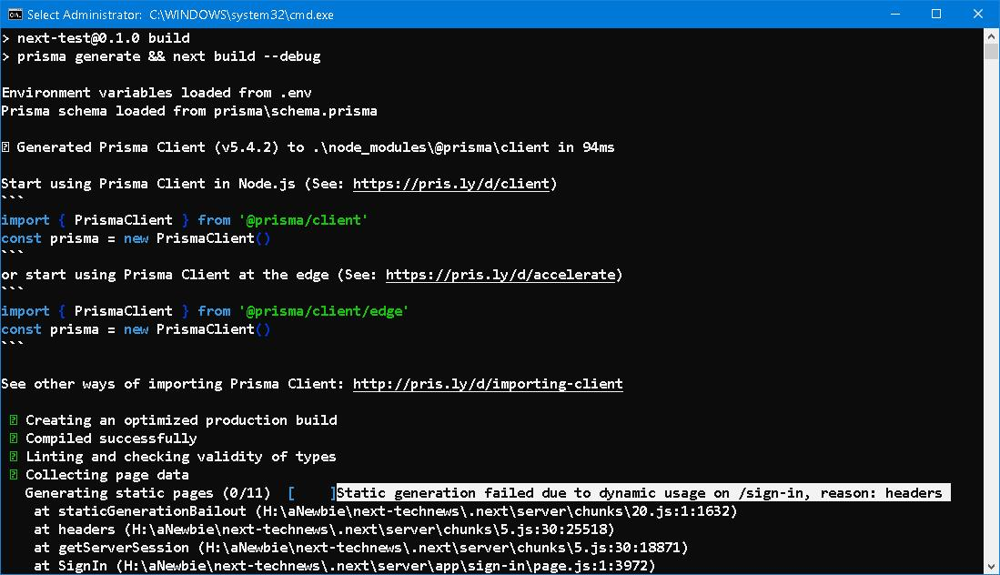
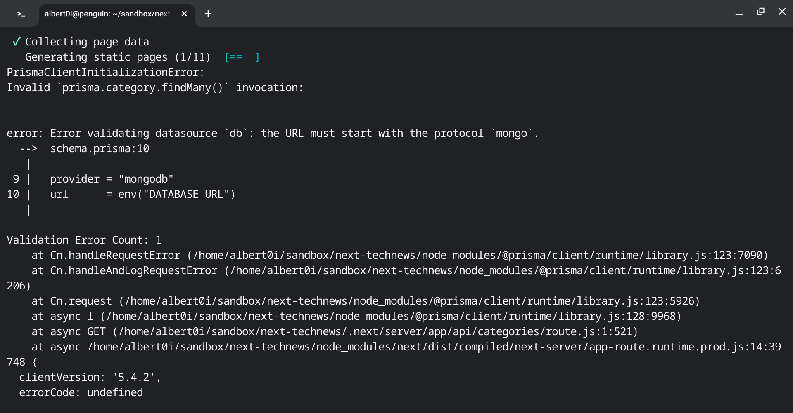

### Tips and Tricks 

### Prologue


### 1. [Next.js CLI](https://nextjs.org/docs/app/api-reference/next-cli)
`next dev` starts the application in development mode. By default, it will start at `http://localhost:3000`, which can be changed with `-p`: 
```
npx next dev -p 3001
```
`-p <port>` also works for `next start`. You can enable more verbose build output with the `--debug` flag in `next build`. 
```
next build --debug
```
With this flag enabled additional build output like rewrites, redirects, and headers will be shown.


### 2. Escalating string literals
```
<body className={inter.className}>
```
to
```
<body className={`${inter.className} `}>
```
And 
```
<button type='submit' className='primary-btn'>Create Post</button>
```
to
```
<button type='submit' className={`primary-btn `}>Create Post</button>
```
In this way, subsequent actions of injecting styles can be fulfilled. 


### 3. [useRouter](https://nextjs.org/docs/app/api-reference/functions/use-router) vs [redirect](https://nextjs.org/docs/app/api-reference/functions/redirect) 
> The `useRouter` hook allows you to programmatically change routes inside Client Components.
> **Recommendation**: Use the `<Link> component` for navigation unless you have a specific requirement for using `useRouter`.

> The `redirect` function allows you to `redirect` the user to another URL. redirect can be used in Server Components, Client Components, [Route Handlers](https://nextjs.org/docs/app/building-your-application/routing/route-handlers), and [Server Actions](https://nextjs.org/docs/app/building-your-application/data-fetching/forms-and-mutations).


### 4. [Check if a Property Exists in a JavaScript Object](https://www.freecodecamp.org/news/how-to-check-if-a-property-exists-in-a-javascript-object/)
```
const myObject = {
    name: 'john',
    age: 26
}

// Method 1: 
if (myObject.name) {
    console.log(myObject.name)
} else {
    console.log('no name')
}

// Method 2: 
if ('name' in myObject) {
    console.log(myObject.name)
} else {
    console.log('no name')
}

// Method 3: 
if (myObject.hasOwnProperty('name')) {
    console.log(myObject.name)
} else {
    console.log('no name')
}
```
> The `hasOwnProperty()` method will check if an object contains a direct property and will return true or false if it exists or not. The `hasOwnProperty()` method will only return true for direct properties and not inherited properties from the prototype chain.

> Unlike the `hasOwnProperty()` method, the `in` operator will return true for both direct and inherited properties that exist in the object or its prototype chain.

> Lastly, we can see if a property exists in the object by checking if `property !== undefined`.


### 5. [min-h-screen](https://tailwindcss.com/docs/min-height) and [flex-auto](https://tailwindcss.com/docs/flex)
```
. . . 
export default function RootLayout({ children }) {
  return (
    <html lang="en">
      <body className={inter.className}>
        <div className='lg:max-w-[900px] lg:px-16 mx-auto py-8 shadow-xl min-h-screen flex flex-col px-8'>
          <div className='flex-auto'>
            {children}
          </div>
        </div>
      </body>
    </html>
  )
}
```
The children is set to full screen height. 


### 6. `fetch` from clinet/server component 
To `fetch` backend api from client component, you can specify relative path, ie
```
const res = await fetch('/api/categories')
```
but 
```
const res = await fetch('http://localhost:3000/api/categories')
```
in server component.


### 7. Environment var in front end
Whenever we are using environment variables in a client component
The name of the environment variable should start with `NEXT_PUBLIC`


### 8. [React Hot Toast](https://react-hot-toast.com/)
layout.js
```
. . . 
export default function RootLayout({ children }) {
  return (
    <html lang="en">
      <body className={inter.className}>
        <NextAuthProvider>
          <div className='lg:max-w-[900px] lg:px-16 mx-auto py-8 shadow-xl min-h-screen flex flex-col px-8'>
            <Navbar />
            <div className='flex-auto'>
              {children}
            </div>
            <Footer />
          </div>

          <Toaster></Toaster>

        </NextAuthProvider>        
      </body>
    </html>
  )
}
```
CreatePostForm.jsx
```
import { toast } from "react-hot-toast";
. . . 
if (res.ok) {
        toast.success('Post created successfully')
        router.push('/dashboard')
        router.refresh()
      } else {
        toast.error('Something went wrong')
      }
    } catch (error) {
      console.log(error)
    }
```


### 9. [heroicons](https://heroicons.com/)
> The quickest way to use these icons is to simply copy the source for the icon you need from [heroicons.com](https://heroicons.com/) and inline it directly into your HTML:

Unlike [Font Awesome](https://fontawesome.com/docs), you don't need to install any package. Just type to search the icon and choose `Outline`, `Solid`, `Mini`, then copy either `SVG` or `JSX` and paste into your code. Definitely, heroicons has less icons than fontasesome. 

bell-alert
```
<svg xmlns="http://www.w3.org/2000/svg" 
fill="none" viewBox="0 0 24 24" strokeWidth={1.5} stroke="currentColor" className="w-6 h-6">
  <path strokeLinecap="round" strokeLinejoin="round" d="M14.857 17.082a23.848 23.848 0 005.454-1.31A8.967 8.967 0 0118 9.75v-.7V9A6 6 0 006 9v.75a8.967 8.967 0 01-2.312 6.022c1.733.64 3.56 1.085 5.455 1.31m5.714 0a24.255 24.255 0 01-5.714 0m5.714 0a3 3 0 11-5.714 0M3.124 7.5A8.969 8.969 0 015.292 3m13.416 0a8.969 8.969 0 012.168 4.5" />
</svg>
```


### 10. Generate random token with `openssl`
```
openssl rand -base64 32 
```


### 11. Importing JSON data
Categories.json
```
[ 
  {
    "id": 1,
    "catName": "Technology"
  },
  {
    "id": 2,
    "catName": "Tips & Tricks"
  },
  {
    "id": 3, 
    "catName": "AI"
  },
  {
    "id": 4,
    "catName": "Web Dev"
  },
  {
    "id": 5,
    "catName": "Programming"
  }
]
```
Page.jsx 
```
import categories from "@/Categories.json"
. . . 
categories.map(category => console.log('category=', category))
```

### 12. [Static generation failed due to dynamic usage](https://github.com/vercel/next.js/discussions/48989)

Add the following to `layout.jsx`
```
export const dynamic = "force-dynamic";
```
> 'force-dynamic': Force dynamic rendering and uncached data fetching of a layout or page by disabling all caching of fetch requests and always revalidating. [...](https://nextjs.org/docs/app/api-reference/file-conventions/route-segment-config#dynamic)


### 13. Error validating datasource `db`: the URL must start with the protocol `mongo`.
```
npm run build
```
The build process works fine in Win10, however in Debian 11, it just can't get `DATABASE_URL` from `.env`! 



It is said that removing the double quotes may help: 

> Removing the quotes worked for me as well. Most .env parsers support quotes around values, but apparently not prisma。[...](https://github.com/prisma/prisma/discussions/12170)

But not in my case... Being overwhelm by desperation... the last resort is to precede the command with environment variable, ie:
```
DATABASE_URL=<your mongodb url> npm run build 
```
and 
```
DATABASE_URL=<your mongodb url> npm start 
```
I have checked the [Environment variables](https://www.prisma.io/docs/guides/development-environment/environment-variables) in prisma doc and still don't know why.... 


### Reference
1. [Build & Deploy a Full-Stack Website with Next.js 13 | Typescript, Prisma, Cloudinary, Tailwind](https://youtu.be/g7rE5exVQRk)
2. [The Brothers Karamazov](https://www.gutenberg.org/cache/epub/28054/pg28054-images.html#chap93)


### Epilogue 


### EOF (2023/10/27)
